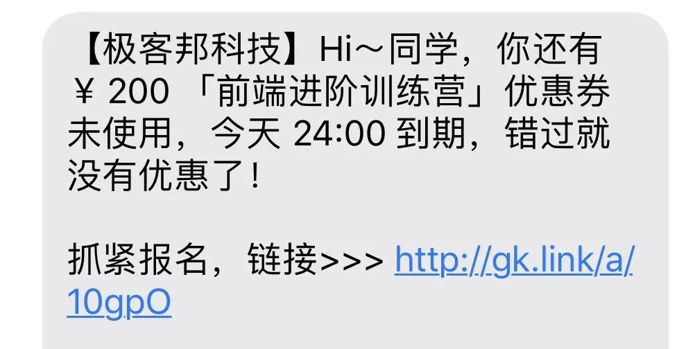

## 背景
路径定义：https://portal-be-uat.amberainsider.com/amc-dev/server/user-center/doc.html
1. swagger文档打开问题
2. 接口配置问题
3. 观感体验

## 短链是什么

## 为什么需要短链
1. 一些app对文本长度有限制，比如短信、微博等。
2. 链接太长在有些平台上无法自动识别为超链接
3. 二维码识别变慢
4. 用户体验
5. 邀请、分享

## 短链的基本流程
### 短链api发布
1. 根据path生成短链
2. 保存短链和path的映射关系
### 短链的使用
1. 根据短链查找path
2. 重定向

## 短链生成

### 1. uuid
需要保证相同长链的短链id唯一。
### 2. 雪花算法
依赖节点时钟一致性
### 3. 自增
缓存（持久化） or 数据库（为每个节点分配号段）  
提高安全性
### 4. 哈希
加密哈希：反解的难度， 如md5, sha等  
查找哈希：速度和冲突概率，如 MurmurHash（性能和随机分布特征明显）, xxHash

#### 哈希冲突的解决
加唯一索引。  
如果数据量太大，冲突概率提升，可以先进行缓存判断，然后插入。  
如果数据量再大，可以考虑加布隆过滤器。

### 如何缩短长度？
62 进制： 0-9, A-Z, a-z
注： 6 位 62 进制数可表示 568 亿的数

## 重定向
302 or 301？
1. 根据业务要求
2. 短链服务器压力
3. 数据分析，比如活动效果分析

## 补充
域名也要尽量短。

## 参考
https://learnku.com/php/t/52596
https://blog.csdn.net/qiwoo_weekly/article/details/125401254