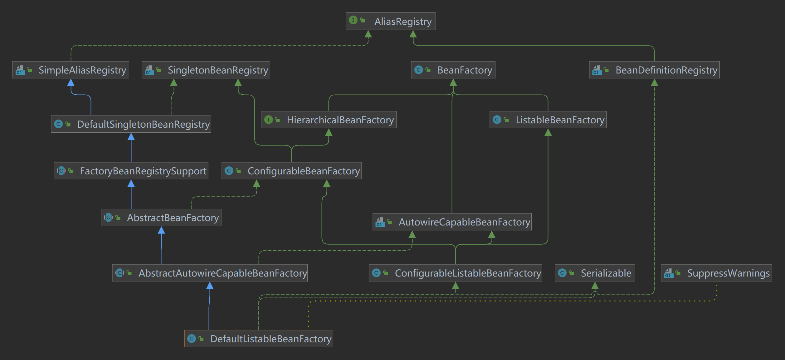

```java
public abstract class AbstractBeanFactory extends FactoryBeanRegistrySupport implements ConfigurableBeanFactory {
    public Object getBean(String name) throws BeansException {
        return doGetBean(name, null, null, false);
    }
    protected <T> T doGetBean(
        String name, @Nullable Class<T> requiredType, @Nullable Object[] args, boolean typeCheckOnly)
        throws BeansException {

        String beanName = transformedBeanName(name);
        Object beanInstance;

        // Eagerly check singleton cache for manually registered singletons.
        // 先从缓存里面找，找不到再去创建
        Object sharedInstance = getSingleton(beanName);
        if (sharedInstance != null && args == null) {
            if (logger.isTraceEnabled()) {
                if (isSingletonCurrentlyInCreation(beanName)) {
                    logger.trace("Returning eagerly cached instance of singleton bean '" + beanName +
                        "' that is not fully initialized yet - a consequence of a circular reference");
                }
                else {
                    logger.trace("Returning cached instance of singleton bean '" + beanName + "'");
                }
            }
            beanInstance = getObjectForBeanInstance(sharedInstance, name, beanName, null);
        }

        else {
            // Fail if we're already creating this bean instance:
            // We're assumably within a circular reference.
            if (isPrototypeCurrentlyInCreation(beanName)) {
                throw new BeanCurrentlyInCreationException(beanName);
            }

            // Check if bean definition exists in this factory.
            BeanFactory parentBeanFactory = getParentBeanFactory();
            if (parentBeanFactory != null && !containsBeanDefinition(beanName)) {
                // Not found -> check parent.
                String nameToLookup = originalBeanName(name);
                if (parentBeanFactory instanceof AbstractBeanFactory) {
                    return ((AbstractBeanFactory) parentBeanFactory).doGetBean(
                        nameToLookup, requiredType, args, typeCheckOnly);
                }
                else if (args != null) {
                    // Delegation to parent with explicit args.
                    return (T) parentBeanFactory.getBean(nameToLookup, args);
                }
                else if (requiredType != null) {
                    // No args -> delegate to standard getBean method.
                    return parentBeanFactory.getBean(nameToLookup, requiredType);
                }
                else {
                    return (T) parentBeanFactory.getBean(nameToLookup);
                }
            }

            if (!typeCheckOnly) {
                markBeanAsCreated(beanName);
            }

            StartupStep beanCreation = this.applicationStartup.start("spring.beans.instantiate")
                .tag("beanName", name);
            try {
                if (requiredType != null) {
                    beanCreation.tag("beanType", requiredType::toString);
                }
                RootBeanDefinition mbd = getMergedLocalBeanDefinition(beanName);
                checkMergedBeanDefinition(mbd, beanName, args);

                // Guarantee initialization of beans that the current bean depends on.
                String[] dependsOn = mbd.getDependsOn();
                if (dependsOn != null) {
                    for (String dep : dependsOn) {
                        if (isDependent(beanName, dep)) {
                            throw new BeanCreationException(mbd.getResourceDescription(), beanName,
                                "Circular depends-on relationship between '" + beanName + "' and '" + dep + "'");
                        }
                        registerDependentBean(dep, beanName);
                        try {
                            getBean(dep);
                        }
                        catch (NoSuchBeanDefinitionException ex) {
                            throw new BeanCreationException(mbd.getResourceDescription(), beanName,
                                "'" + beanName + "' depends on missing bean '" + dep + "'", ex);
                        }
                    }
                }

                // Create bean instance.
                if (mbd.isSingleton()) {
                    sharedInstance = getSingleton(beanName, () -> {
                        try {
                            return createBean(beanName, mbd, args);
                        }
                        catch (BeansException ex) {
                            // Explicitly remove instance from singleton cache: It might have been put there
                            // eagerly by the creation process, to allow for circular reference resolution.
                            // Also remove any beans that received a temporary reference to the bean.
                            destroySingleton(beanName);
                            throw ex;
                        }
                    });
                    beanInstance = getObjectForBeanInstance(sharedInstance, name, beanName, mbd);
                }

                else if (mbd.isPrototype()) {
                    // It's a prototype -> create a new instance.
                    Object prototypeInstance = null;
                    try {
                        beforePrototypeCreation(beanName);
                        prototypeInstance = createBean(beanName, mbd, args);
                    }
                    finally {
                        afterPrototypeCreation(beanName);
                    }
                    beanInstance = getObjectForBeanInstance(prototypeInstance, name, beanName, mbd);
                }

                else {
                    String scopeName = mbd.getScope();
                    if (!StringUtils.hasLength(scopeName)) {
                        throw new IllegalStateException("No scope name defined for bean '" + beanName + "'");
                    }
                    Scope scope = this.scopes.get(scopeName);
                    if (scope == null) {
                        throw new IllegalStateException("No Scope registered for scope name '" + scopeName + "'");
                    }
                    try {
                        Object scopedInstance = scope.get(beanName, () -> {
                            beforePrototypeCreation(beanName);
                            try {
                                return createBean(beanName, mbd, args);
                            }
                            finally {
                                afterPrototypeCreation(beanName);
                            }
                        });
                        beanInstance = getObjectForBeanInstance(scopedInstance, name, beanName, mbd);
                    }
                    catch (IllegalStateException ex) {
                        throw new ScopeNotActiveException(beanName, scopeName, ex);
                    }
                }
            }
            catch (BeansException ex) {
                beanCreation.tag("exception", ex.getClass().toString());
                beanCreation.tag("message", String.valueOf(ex.getMessage()));
                cleanupAfterBeanCreationFailure(beanName);
                throw ex;
            }
            finally {
                beanCreation.end();
            }
        }

        return adaptBeanInstance(name, beanInstance, requiredType);
    }
}

public class DefaultSingletonBeanRegistry extends SimpleAliasRegistry implements SingletonBeanRegistry {
    public Object getSingleton(String beanName, ObjectFactory<?> singletonFactory) {
        Assert.notNull(beanName, "Bean name must not be null");
        synchronized (this.singletonObjects) {
            Object singletonObject = this.singletonObjects.get(beanName);
            if (singletonObject == null) {
                if (this.singletonsCurrentlyInDestruction) {
                    throw new BeanCreationNotAllowedException(beanName,
                        "Singleton bean creation not allowed while singletons of this factory are in destruction " +
                            "(Do not request a bean from a BeanFactory in a destroy method implementation!)");
                }
                if (logger.isDebugEnabled()) {
                    logger.debug("Creating shared instance of singleton bean '" + beanName + "'");
                }
                // 记录哪些bean正在创建过程中
                beforeSingletonCreation(beanName);
                boolean newSingleton = false;
                boolean recordSuppressedExceptions = (this.suppressedExceptions == null);
                if (recordSuppressedExceptions) {
                    this.suppressedExceptions = new LinkedHashSet<>();
                }
                try {
                    // 创建bean
                    singletonObject = singletonFactory.getObject();
                    newSingleton = true;
                }
                catch (IllegalStateException ex) {
                    // Has the singleton object implicitly appeared in the meantime ->
                    // if yes, proceed with it since the exception indicates that state.
                    singletonObject = this.singletonObjects.get(beanName);
                    if (singletonObject == null) {
                        throw ex;
                    }
                }
                catch (BeanCreationException ex) {
                    if (recordSuppressedExceptions) {
                        for (Exception suppressedException : this.suppressedExceptions) {
                            ex.addRelatedCause(suppressedException);
                        }
                    }
                    throw ex;
                }
                finally {
                    if (recordSuppressedExceptions) {
                        this.suppressedExceptions = null;
                    }
                    // bean创建完成，记录bean已经不在创建过程中
                    afterSingletonCreation(beanName);
                }
                if (newSingleton) {
                    // bean创建成功，添加到一级缓存
                    addSingleton(beanName, singletonObject);
                }
            }
            return singletonObject;
        }
    }
}

public abstract class AbstractAutowireCapableBeanFactory extends AbstractBeanFactory
    implements AutowireCapableBeanFactory {
    protected Object doCreateBean(String beanName, RootBeanDefinition mbd, @Nullable Object[] args)
        throws BeanCreationException {

        // Instantiate the bean.
        BeanWrapper instanceWrapper = null;
        if (mbd.isSingleton()) {
            instanceWrapper = this.factoryBeanInstanceCache.remove(beanName);
        }
        if (instanceWrapper == null) {
            // step1、实例化
            instanceWrapper = createBeanInstance(beanName, mbd, args);
        }
        Object bean = instanceWrapper.getWrappedInstance();
        Class<?> beanType = instanceWrapper.getWrappedClass();
        if (beanType != NullBean.class) {
            mbd.resolvedTargetType = beanType;
        }

        // Allow post-processors to modify the merged bean definition.
        // bean的后处理，AOP
        synchronized (mbd.postProcessingLock) {
            if (!mbd.postProcessed) {
                try {
                    applyMergedBeanDefinitionPostProcessors(mbd, beanType, beanName);
                }
                catch (Throwable ex) {
                    throw new BeanCreationException(mbd.getResourceDescription(), beanName,
                        "Post-processing of merged bean definition failed", ex);
                }
                mbd.postProcessed = true;
            }
        }

        // Eagerly cache singletons to be able to resolve circular references
        // even when triggered by lifecycle interfaces like BeanFactoryAware.
        boolean earlySingletonExposure = (mbd.isSingleton() && this.allowCircularReferences &&
            isSingletonCurrentlyInCreation(beanName));
        if (earlySingletonExposure) {
            if (logger.isTraceEnabled()) {
                logger.trace("Eagerly caching bean '" + beanName +
                    "' to allow for resolving potential circular references");
            }
            // 添加到第三级缓存
            addSingletonFactory(beanName, () -> getEarlyBeanReference(beanName, mbd, bean));
        }

        // Initialize the bean instance.
        Object exposedObject = bean;
        try {
            // step2、属性注入
            populateBean(beanName, mbd, instanceWrapper);
            // step3、初始化
            exposedObject = initializeBean(beanName, exposedObject, mbd);
        }
        catch (Throwable ex) {
            if (ex instanceof BeanCreationException && beanName.equals(((BeanCreationException) ex).getBeanName())) {
                throw (BeanCreationException) ex;
            }
            else {
                throw new BeanCreationException(
                    mbd.getResourceDescription(), beanName, "Initialization of bean failed", ex);
            }
        }

        if (earlySingletonExposure) {
            Object earlySingletonReference = getSingleton(beanName, false);
            if (earlySingletonReference != null) {
                if (exposedObject == bean) {
                    exposedObject = earlySingletonReference;
                }
                else if (!this.allowRawInjectionDespiteWrapping && hasDependentBean(beanName)) {
                    String[] dependentBeans = getDependentBeans(beanName);
                    Set<String> actualDependentBeans = new LinkedHashSet<>(dependentBeans.length);
                    for (String dependentBean : dependentBeans) {
                        if (!removeSingletonIfCreatedForTypeCheckOnly(dependentBean)) {
                            actualDependentBeans.add(dependentBean);
                        }
                    }
                    if (!actualDependentBeans.isEmpty()) {
                        throw new BeanCurrentlyInCreationException(beanName,
                            "Bean with name '" + beanName + "' has been injected into other beans [" +
                                StringUtils.collectionToCommaDelimitedString(actualDependentBeans) +
                                "] in its raw version as part of a circular reference, but has eventually been " +
                                "wrapped. This means that said other beans do not use the final version of the " +
                                "bean. This is often the result of over-eager type matching - consider using " +
                                "'getBeanNamesForType' with the 'allowEagerInit' flag turned off, for example.");
                    }
                }
            }
        }

        // Register bean as disposable.
        try {
            registerDisposableBeanIfNecessary(beanName, bean, mbd);
        }
        catch (BeanDefinitionValidationException ex) {
            throw new BeanCreationException(
                mbd.getResourceDescription(), beanName, "Invalid destruction signature", ex);
        }

        return exposedObject;
    }
}
```
