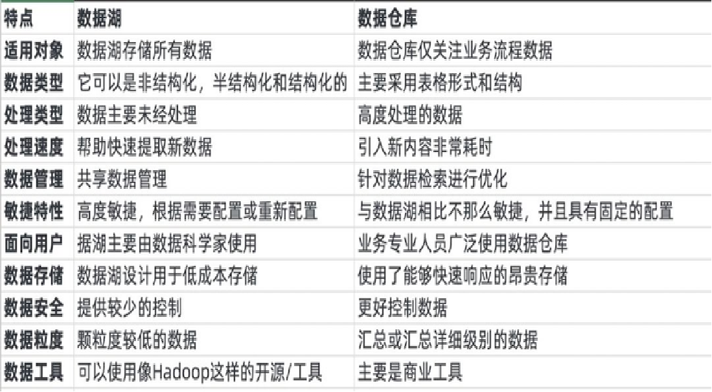
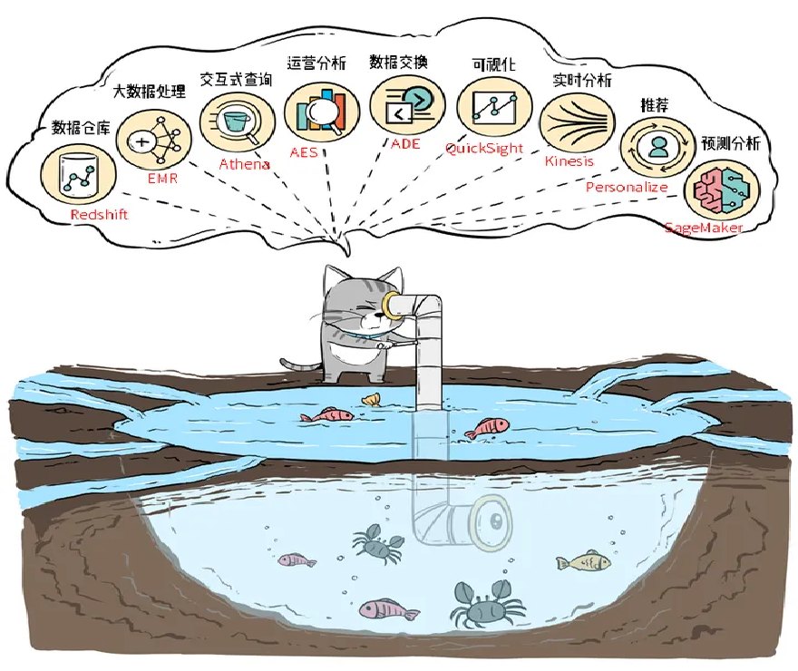

# 概念区分
## 数据库
数据库的应用很常见，基本上每个业务系统都会有自己的数据库

## 数据仓库
数据仓库的核心是有序性，主要为了分析用。在原有数据库的基础上，数据经过OLAP和ETL后，得出能够被业务人员直接进行分析的业务数据包，存放在数据仓库里面。

通常来说，数据仓库都是结构化的数据，数据仓库基本上和BI一起使用，前者负责把数据处理好，后者进行前端数据展示。

## 数据湖
把生产经营中产生的所有原始数据都能够全部放进去，方便后面要用的时候直接从这里面拿。不一定是结构化的数据。

数据湖的核心是开放性，里面是无序的数据。想要用好数据湖，一个是存储的架构要足够强大（存得下、放得久，容忍小文件的频繁修改删除，ACID），另一个是数据处理足够牛逼（存放在里面的时候，以及用的时候拿出来的时候都要足够顺滑）。

## 湖仓一体
可以理解为把数据湖这个大杂间分了很多的区，就是把数据湖作为中央存储库，围绕数据湖建立各种提供服务的站点，比如数据仓库，供业务分析和接入BI使用；再比如供就一起学习的站点；供大数据处理的站点等等，最终实现随心所欲地使用数据湖中的数据。
